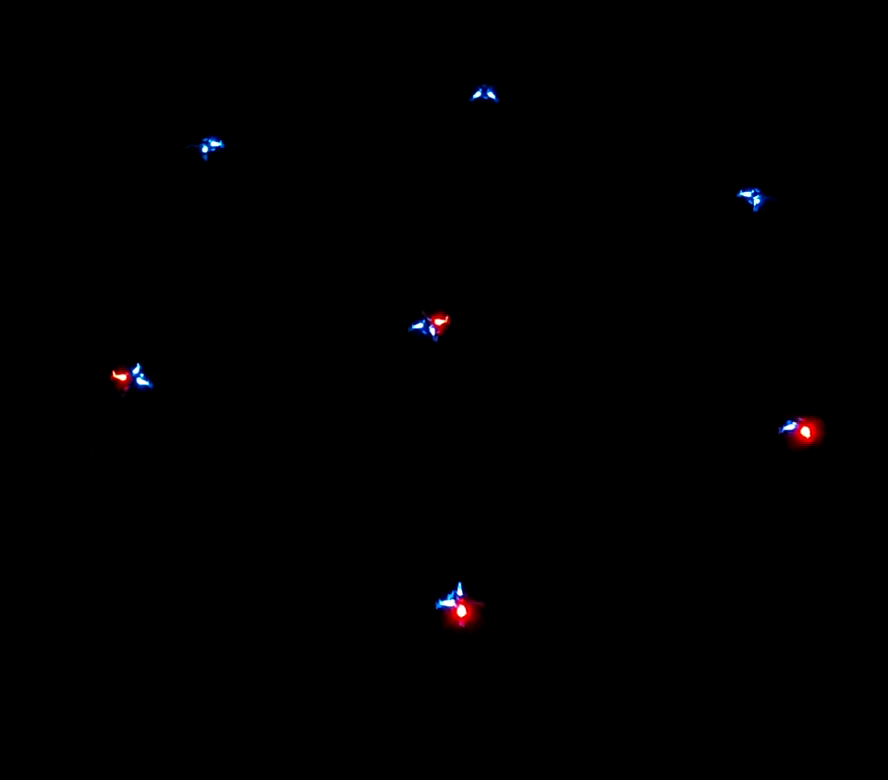
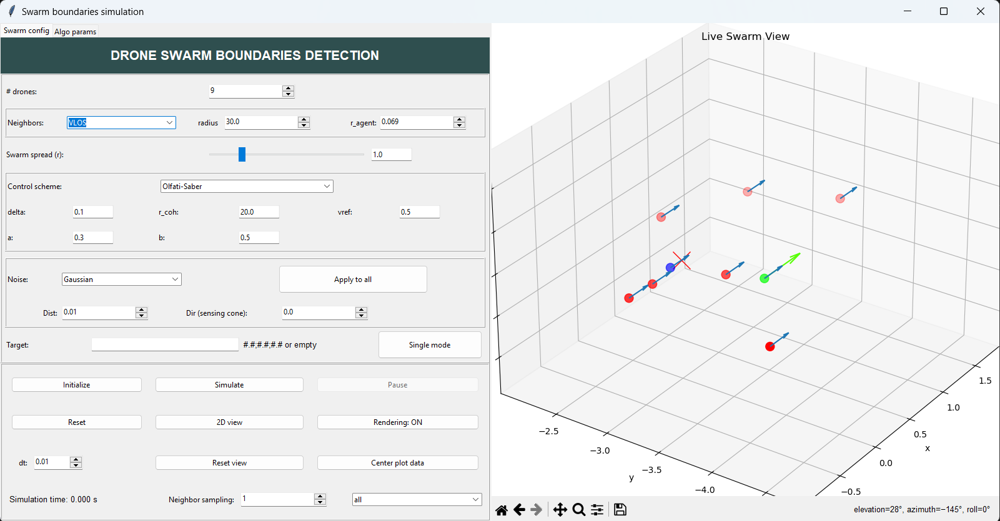
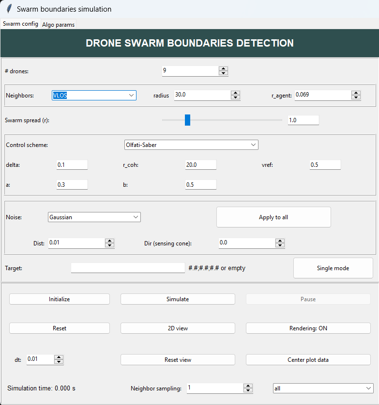
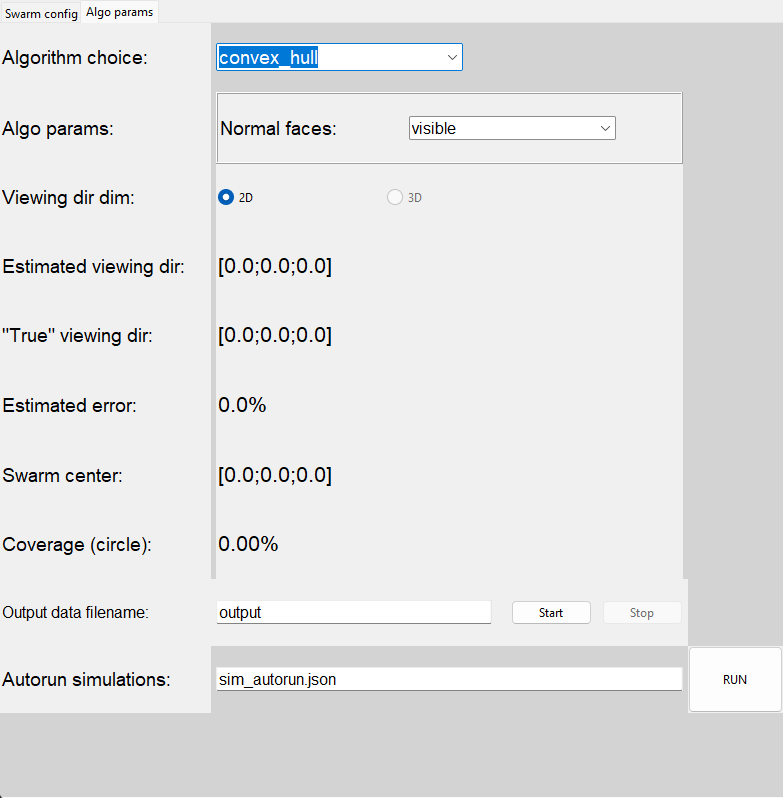
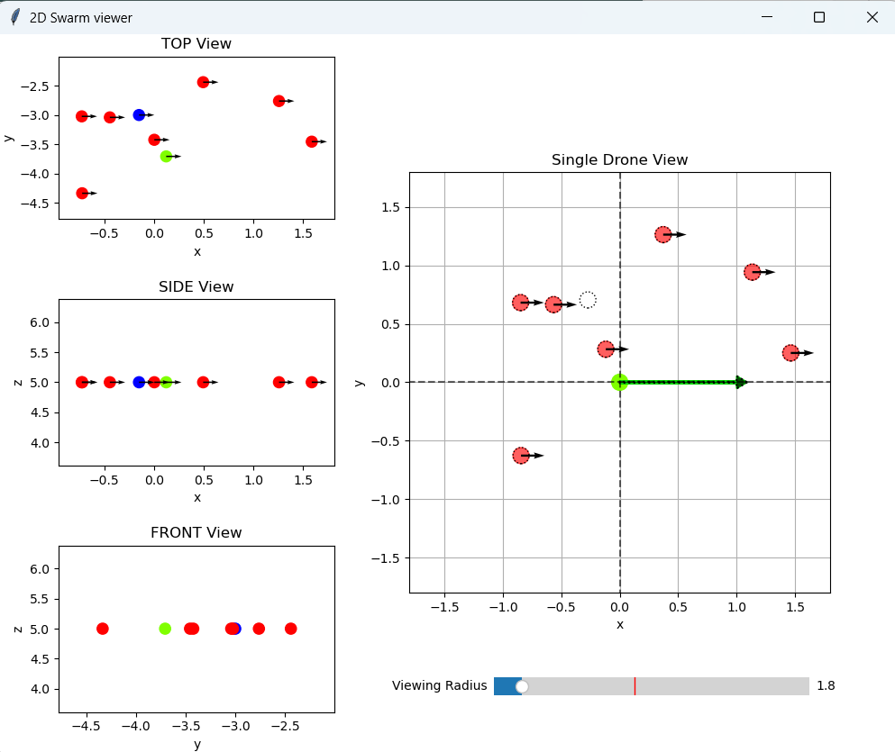
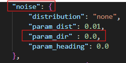

# Python swarm simulator
## LIS - Semester project

:arrow_right: [Project Report](extras/RO1_LIS_Report_final.pdf) (IEEE conference style paper)

:dark_sunglasses: Check out some cool [demos](https://youtube.com/playlist?list=PL8cx2cevn_sbnwVWY66kf_ksNLqBBo-WO&si=GFOuRQenx1OGiNKr) using crazyfly drones


## Viewing Coverage Optimization In Aerial Swarm with Local Sensing
### Author: Alexandre Hébert
#### Supervised by Benjamin Jarvis

<p float="left">
  
   
  
</p>

#### Description

Simple simulator built to assess the performance of different viewing coverage strategies using only local sensing (detected neighbors). 

The simnulator models drones as 3D points with unit mass (meaning acceleration is directly equal to force).

#### Installation

> _Tip_: Install all the required python packages in a virtual env (such as python venv module or anaconda)

All the required packages are defined in the _requirements.txt_ file.

#### Getting started

**1. App configuration file**

Most of the parameters used in the simulator can be directly set within the app configuration json file (_app_config.json_). The file is automatically created using the provided template (_app_config_template.json_). The naming convention of the parameters defined in the app configuration file is essential for the autorun feature (see section 3).

**2. Basic fonctionalities**

> A. Main interface

<p style="text-align:center">
  
  <br> On the left, the simulation parameters and controls.
  <br> On the right, the 3D rendering of the drones and their viewing direction
</p>

> B. Simulation panel

<p style="text-align:center">
  
</p>

Here, the swarm parameters can be set (such as the number of drones, the control scheme, the neighbor selection, the noise, etc.). Moreover, all the buttons for managing the simulator are located in the bottom section. The simulation time is shown in the bottom left corner.

> C. Viewing algorithm parameters

<p style="text-align:center">
  
</p>

Choosing the other tab, the viewing direction algorithm can be changed and all the calculated metrics are displayed as well. Autorun configuration is also done in this tab.

> D. 2D view window

<p style="text-align:center">
  
</p>

Finally, clicking on the 2D view button opens a new window displaying different projections of the swarm (xy, xz, yz). It also shows a top view of the selected drone with the detected neighbors (noisy) and the ground truth position of all the swarm members (with dotted lines). This is really useful for validating which neighbors are detected and included in the computation of the optimal viewing direction. Finally, dot sizes are scaled accordingly with respect to the _r_agent_ parameter defined in the app config or the VLOS neighbor selection scheme.

**3. Autorun feature**

This is one of the most heplful feature of this simulator: being able to define simulations in a file and run them automatically. Some example files (used during my semester project) are already present in the config folder (e.g. _autorun_sim_noise.json_)

The basic structure is the followig:

``` 
{
    "FOLDER_NAME": {
        "metrics": ["neighbors_metric"], #Llist of constant metrics to be set for all subtests
        "values": ["Topological"], # Their values
        "var": [  #Variables to perform the different runs on
            {     # Each object represents a set of values to try
                "name": "viewing_metric_algorithm",
                "values": ["convex_hull_adjacent", "convex_hull_visible"]
            },
            {
                "name": "neighbors_count",
                "values": [2]
            }
        ],
        "repeat": 1
    }
}
```


The working principle is the following: after defining all the variables and their assigned values to try, the autorun engine will generate all possible combinations for the defined varaibles and values, and then run all the subtests. The _repeat_ attribute is used to average over multiple run the same subtest.

The variables name are the same as thsoe defined in the app config file. Nested variable (within an object) are defined by using the parents name and adding **_** between each layers.

Ex: 

<p style="text-align:center">
  
  <br> "name" : "noise_param_dir"
  <br> "value" : 0.0
</p>

Data is then exported in the specified folder as independent _.npy_ files (one for each subtest).

#### Next steps

- Add supplmentary layer in between GUI and simulator to be able to use the autorun feature without instantiating the GUI (run all simulations directly from command line)

- Change config and autorun files to yaml instead of json (for convenience)

- Add other flocking algorithms (such as Renoylds)

- Add obstacle modelling

